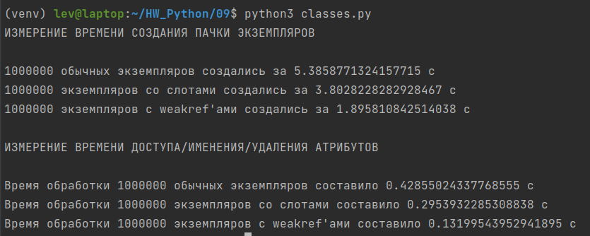
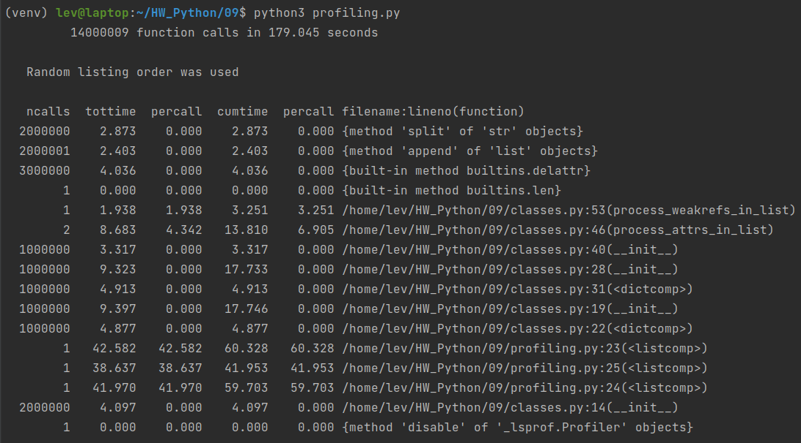
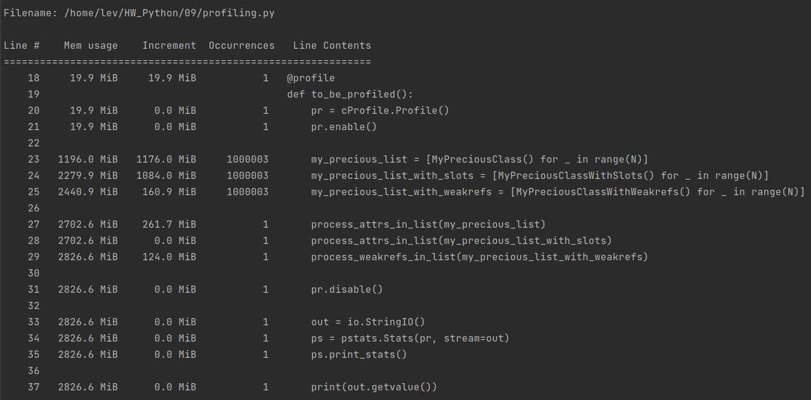

# Домашнее задание #09

### [Перейти к отчету](#Отчет)

## Задание

### 1. Сравнение использования weakref и слотов

Нужно придумать свои типы с несколькими атрибутами:

- класс с обычными атрибутами
- класс со слотами
- класс с атрибутами weakref

Для каждого класса создается большое число экземпляров и замеряется (сравнивается):

- время создания пачки экземпляров
- время доступа/изменения/удаления атрибутов

Результаты оформляются скриншотами c описанием.

### 2. Профилирование

Провести профилирование вызовов и памяти для кода из пункта 1.

Результаты оформляются скриншотами c описанием.

### 3. Декоратор для профилирования

Применение декоратора к функции должно выполнять прoфилирование вызовов (cProfile) всех запусков данной функции.
Вызов метода `.print_stat()` должен выводить статистику профилирования.

```py
def profile_deco():
    ...


@profile_deco
def add(a, b):
    return a + b


@profile_deco
def sub(a, b):
    return a - b


add(1, 2)
add(4, 5)

add.print_stat()  # выводится таблица с результатами профилирования суммарно по всем запускам
```

### 4. Тесты не нужны

### 5. Перед отправкой на проверку код должен быть прогнан через flake8 и pylint, по желанию еще black

## Отчет

### Сравнение использования обычных атрибутов, `__slots__` и `weakref` (вручную)

Для выполнения сравнения написан файл [classes.py](classes.py)

Вы можете его запустить и статистику выполнения на своём компьютере:

```bash
python3 classes.py
```

У меня получились следующие результаты:



Из них следует, что использование `__slots__` ускоряет время выполнения на ~30 %

С `weakref`'ами у меня хоть несколько другая логика, но всё равно можно сделать вывод, что создание слабых ссылок вместо
инициализации объекта ускоряет время выполнения в разы

### Профилирование вызовов и памяти

Для выполнения профилирования я написал файл [profiling.py](profiling.py)

```bash
python3 profiling.py
```

Результаты профилирования:



По результатам профилирования видно, что совокупное время создания классов с `weakref`'ами оказалось в 5 раз меньше, чем
у классов с обычными атрибутами или слотами. Выигрыш `__slots__` по сравнению с обычными атрибутами оказался на уровне
погрешности.

Очевидно, что из-за этого list comprehension для класса с `weakref`'ами отработал в полтора раза быстрее.

Интересно, что `process_weakrefs_in_list` сработал не так уж и быстро по сравнению с обработкой обычных классов



По памяти всё в принципе очевидно и предсказуемо:

- за счет уменьшения количества встроенных атрибутов класс со `__slots__` занимает чуть меньше места
- `weakref` является лишь ссылкой на объект, поэтому занимает на порядок меньше памяти

###